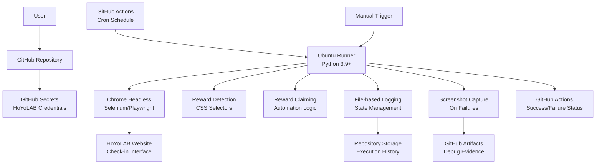
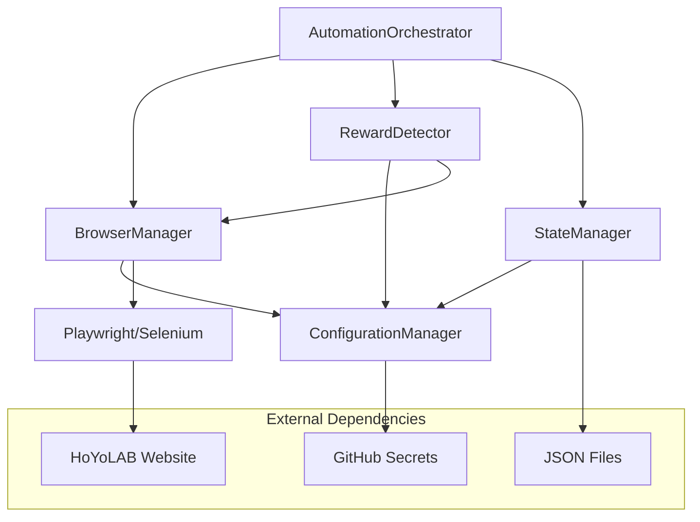
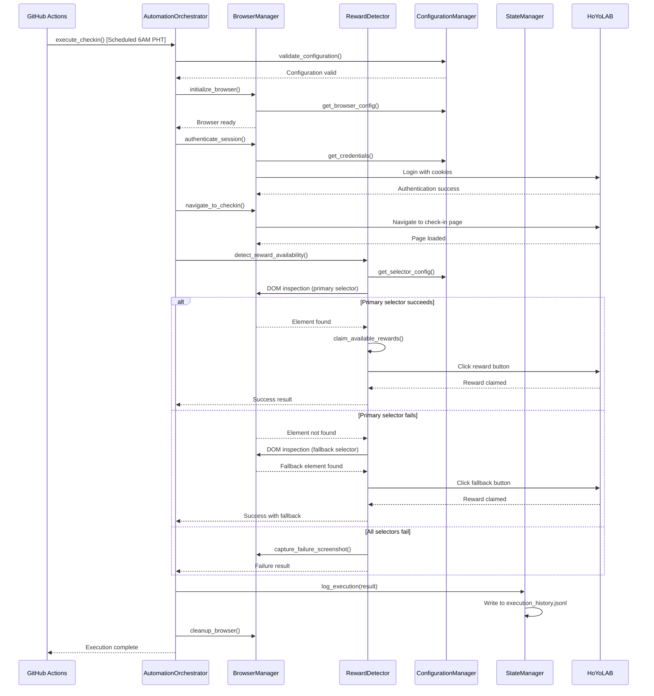
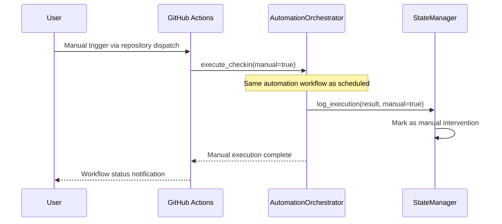
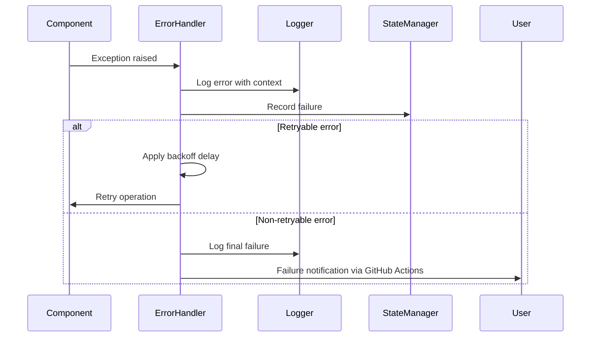

# Genshin Impact Check-in Bot Fullstack Architecture Document

## Introduction

This document outlines the complete fullstack architecture for **Genshin Impact Check-in Bot**, including backend systems, frontend implementation, and their integration. It serves as the single source of truth for AI-driven development, ensuring consistency across the entire technology stack.

This unified approach combines what would traditionally be separate backend and frontend architecture documents, streamlining the development process for modern fullstack applications where these concerns are increasingly intertwined.

### Starter Template or Existing Project

**N/A - Greenfield project**

This is a greenfield automation project with no existing codebase or starter templates. The architecture will be designed from scratch to meet the specific requirements of HoYoLAB browser automation within GitHub Actions constraints.

### Change Log

| Date | Version | Description | Author |
|------|---------|-------------|--------|
| 2025-09-29 | v1.0 | Initial architecture document creation from PRD v1.0 | Winston (Architect) |

## High Level Architecture

### Technical Summary

The Genshin Impact Check-in Bot employs a **serverless automation architecture** deployed on GitHub Actions, utilizing Python-based browser automation to interact with the HoYoLAB web interface. The system follows a **monolithic script pattern** optimized for cloud execution constraints, implementing intelligent reward detection through CSS selector strategies and robust error handling. The architecture prioritizes **reliability over complexity**, using file-based state management and comprehensive logging to achieve the required 70% success rate. GitHub Secrets provide secure credential management while maintaining zero-cost operation within free tier limits. The design emphasizes **educational value** through clear separation of concerns, extensive documentation, and maintainable code patterns suitable for portfolio demonstration.

### Platform and Infrastructure Choice

**Selected Platform:** GitHub Actions + GitHub Repository Storage
**Key Services:** GitHub Actions (compute), GitHub Secrets (credential management), GitHub Repository (code and logs storage)
**Deployment Host and Regions:** GitHub's global infrastructure (automatic region selection)

**Rationale:** GitHub Actions perfectly aligns with project requirements - zero cost, educational value, integrated security, and sufficient compute resources for browser automation. The 5-minute timeout is manageable for check-in operations, and repository storage handles state management effectively.

### Repository Structure

**Structure:** Monorepo with clear separation of concerns
**Monorepo Tool:** Native Python packaging (no complex tooling needed)
**Package Organization:** Functional separation by Epic boundaries

```
genshin-checkin-bot/
├── src/                        # Core automation code
│   ├── automation/             # Browser automation logic
│   ├── detection/              # Reward detection strategies  
│   ├── config/                 # Configuration management
│   └── utils/                  # Shared utilities
├── tests/                      # Comprehensive test suite
├── .github/workflows/          # GitHub Actions workflows
├── docs/                       # Documentation and architecture
├── logs/                       # Execution history and state
└── scripts/                    # Setup and maintenance scripts
```

### High Level Architecture Diagram



### Architectural Patterns

- **Serverless Automation Pattern:** Stateless execution optimized for cloud environments with minimal resource usage - _Rationale:_ Perfect fit for GitHub Actions constraints and zero-cost operation
- **Circuit Breaker Pattern:** Fail-fast with retry logic to handle transient failures and prevent resource waste - _Rationale:_ Essential for unreliable web automation scenarios
- **Strategy Pattern:** Multiple CSS selector detection strategies with fallback mechanisms - _Rationale:_ Handles website changes and improves reliability
- **Command Pattern:** Encapsulated automation actions for testing and maintenance - _Rationale:_ Enables unit testing and modular development
- **Observer Pattern:** Event-driven logging and state management throughout automation lifecycle - _Rationale:_ Comprehensive debugging and success rate tracking
- **Template Method Pattern:** Standardized automation workflow with customizable steps - _Rationale:_ Consistent execution while allowing Epic-based enhancements

## Tech Stack

This is the DEFINITIVE technology selection for the entire project. All development must use these exact versions.

| Category | Technology | Version | Purpose | Rationale |
|----------|------------|---------|---------|-----------|
| Backend Language | Python | 3.9+ | Core automation logic and browser control | Mature ecosystem for web automation, excellent library support, readable for educational goals |
| Browser Automation | Playwright | ^1.40.0 | Primary web automation framework | Superior reliability vs Selenium, better async support, built-in waiting strategies, excellent debugging tools |
| Browser Automation (Fallback) | Selenium WebDriver | ^4.15.0 | Backup automation option | Widely documented, fallback if Playwright issues, industry standard for learning |
| Browser Engine | Chromium | Latest (via Playwright) | Headless browser execution | Consistent rendering, good GitHub Actions support, reliable automation target |
| HTTP Client | httpx | ^0.25.0 | API requests and session management | Async support, better than requests for automation, HTTP/2 support |
| Configuration Management | python-decouple | ^3.8 | Environment variable handling | Secure config management, no hardcoded secrets, type conversion support |
| Logging Framework | structlog | ^23.1.0 | Structured logging with context | JSON logging, excellent debugging, GitHub Actions compatibility |
| State Management | JSON (stdlib) | Built-in | Execution history and success tracking | Simple, readable, no external dependencies, GitHub-friendly storage |
| Testing Framework | pytest | ^7.4.0 | Unit and integration testing | Industry standard, excellent fixture support, parametrization capabilities |
| Browser Testing | pytest-playwright | ^0.4.0 | Browser automation testing | Seamless Playwright integration, async test support |
| Assertion Library | pytest (built-in) | ^7.4.0 | Test assertions and validation | Comprehensive assertion methods, clear error messages |
| Mocking Framework | pytest-mock | ^3.11.0 | Test isolation and mocking | Clean mock syntax, pytest integration, reduces external dependencies |
| Code Formatting | black | ^23.7.0 | Consistent code style | Opinionated formatting, educational readability, industry adoption |
| Import Sorting | isort | ^5.12.0 | Import organization | Clean import structure, black compatibility |
| Linting | flake8 | ^6.0.0 | Code quality enforcement | Catches common errors, educational best practices |
| Type Checking | mypy | ^1.5.0 | Static type analysis | Type safety, better IDE support, documentation through types |
| Dependency Management | pip + requirements.txt | Latest | Package management | Simple, GitHub Actions native, exact version control |
| CI/CD Platform | GitHub Actions | N/A | Automation scheduling and execution | Zero-cost, integrated secrets, Ubuntu environment, cron scheduling |
| Secret Management | GitHub Secrets | N/A | Secure credential storage | Built-in encryption, environment variable injection, audit logging |
| Documentation | Markdown + GitHub Pages | N/A | Project documentation and guides | GitHub integration, zero-cost hosting, version control |
| Container Runtime | Docker (optional) | ^24.0.0 | Local development consistency | Optional for environment consistency, GitHub Actions has native support |
| Notification System | GitHub Actions Status | N/A | Success/failure alerting | Built-in workflow notifications, email integration available |

## Data Models

Based on the PRD requirements, the system needs minimal but well-defined data models to support automation workflow, state tracking, and success rate measurement.

### Simplified ExecutionLog

**Purpose:** Single record per automation run for success rate tracking and failure analysis

**Key Attributes:**
- timestamp: str - ISO 8601 execution time for sorting and period calculations
- success: bool - Simple binary success/failure for NFR1 calculation  
- duration_seconds: float - Performance monitoring for GitHub Actions timeout management
- error_message: Optional[str] - Failure reason for debugging (only when success=false)
- screenshot_artifact: Optional[str] - GitHub Actions artifact name for failure screenshots
- selector_used: str - Which CSS detection strategy succeeded ("primary", "fallback_1", "fallback_2")

**Simplified Python Data Structure:**
```python
@dataclass
class ExecutionLog:
    timestamp: str  # ISO 8601
    success: bool
    duration_seconds: float
    error_message: Optional[str] = None
    screenshot_artifact: Optional[str] = None
    selector_used: str = "primary"
    
    def to_dict(self) -> dict:
        return asdict(self)
```

**Storage Implementation:**
```python
# Simple JSON Lines format - one log entry per line
# logs/execution_history.jsonl
{"timestamp": "2025-09-29T06:00:00Z", "success": true, "duration_seconds": 23.4, "selector_used": "primary"}
{"timestamp": "2025-09-30T06:00:00Z", "success": false, "duration_seconds": 45.2, "error_message": "Element not found", "screenshot_artifact": "failure-2025-09-30.png", "selector_used": "fallback_1"}
```

**Success Rate Calculation (On-Demand):**
```python
def calculate_success_rate(days: int = 30) -> float:
    """Calculate success rate for last N days from log file"""
    cutoff = datetime.now() - timedelta(days=days)
    
    with open('logs/execution_history.jsonl', 'r') as f:
        logs = [json.loads(line) for line in f 
                if datetime.fromisoformat(json.loads(line)['timestamp']) >= cutoff]
    
    if not logs:
        return 0.0
        
    successful = sum(1 for log in logs if log['success'])
    return (successful / len(logs)) * 100
```

## API Specification

Based on the architectural analysis and tech stack selection, this project operates as a **monolithic automation script** without traditional API endpoints. However, the system interfaces with external APIs and internal configuration that requires specification.

### HoYoLAB Web Interface Integration

**Purpose:** Document the web interface interactions that the automation performs, serving as both API documentation and integration contract.

**Base URL:** `https://act.hoyolab.com/`

**Authentication Method:** Cookie-based session authentication with CSRF protection

**Key Interface Points:**

**Check-in Page Navigation:**
- **URL Pattern:** `/ys/event/signin-sea-v3/index.html?act_id={ACT_ID}`
- **Method:** GET (Browser navigation)
- **Authentication:** Required - Session cookies from login flow
- **Purpose:** Navigate to Genshin Impact daily check-in interface

**Reward State Detection:**
- **Interface Type:** DOM element inspection
- **Detection Selectors:** 
  - Primary: `.calendar-container .today-sign` (current day indicator)
  - Fallback 1: `[data-testid="check-in-button"]` 
  - Fallback 2: `.sign-in-btn:not(.disabled)`
- **Response Analysis:** Element presence and CSS classes determine reward availability

**Reward Claiming Action:**
- **Interface Type:** DOM interaction (click event)
- **Target Selector:** Dynamically determined from detection phase
- **Expected Response:** UI state change + success/error message display
- **Validation:** Post-action DOM inspection for confirmation

### Configuration API (Environment Variables)

**Required Environment Variables:**
```bash
# Authentication (GitHub Secrets in production)
HOYOLAB_LTUID=123456789              # HoYoLAB user ID
HOYOLAB_LTOKEN=abcdef123456789       # HoYoLAB auth token

# Automation Configuration
CHECKIN_URL=https://act.hoyolab.com/ys/event/signin-sea-v3/index.html
ACT_ID=e202102251931481             # Activity ID for Genshin Impact check-in
USER_AGENT="Mozilla/5.0 (Macintosh; Intel Mac OS X 10_15_7)..."

# Timing Configuration (seconds)
MIN_DELAY=2.0                       # Minimum wait between actions
MAX_DELAY=8.0                       # Maximum wait between actions  
PAGE_LOAD_TIMEOUT=30.0              # Maximum page load wait time
ELEMENT_TIMEOUT=15.0                # Maximum element detection wait time

# CSS Selector Configuration (fallback strategies)
PRIMARY_SELECTOR=".calendar-container .today-sign"
FALLBACK_SELECTOR_1="[data-testid='check-in-button']"
FALLBACK_SELECTOR_2=".sign-in-btn:not(.disabled)"

# Logging Configuration
LOG_LEVEL=INFO                      # DEBUG, INFO, WARNING, ERROR
SCREENSHOT_ON_FAILURE=true          # Capture failure screenshots
LOG_DOM_SNAPSHOTS=false            # Include DOM content in logs (debug only)
```

## Components

Based on the architectural patterns, tech stack, and data models from above, the system comprises several major logical components that work together to achieve reliable HoYoLAB automation.

### AutomationOrchestrator

**Responsibility:** Main entry point that coordinates the complete check-in workflow from authentication through reward collection and state logging.

**Key Interfaces:**
- `execute_checkin()` - Main automation workflow execution
- `handle_failure(exception)` - Centralized error handling and recovery
- `log_execution_result(result)` - State management and success tracking

**Dependencies:** BrowserManager, RewardDetector, ConfigurationManager, StateManager

**Technology Stack:** Python 3.9+, structlog for logging, python-decouple for configuration

### BrowserManager  

**Responsibility:** Browser lifecycle management including initialization, authentication, navigation, and cleanup with anti-bot detection measures.

**Key Interfaces:**
- `initialize_browser()` - Setup Playwright/Selenium with proper configuration
- `authenticate_session()` - Handle HoYoLAB login flow with credential security
- `navigate_to_checkin()` - Navigate to check-in page with wait conditions
- `capture_failure_screenshot()` - Debug evidence collection

**Dependencies:** ConfigurationManager for browser settings and credentials

**Technology Stack:** Playwright (primary), Selenium WebDriver (fallback), httpx for session management

### RewardDetector

**Responsibility:** Intelligent reward state detection using multiple CSS selector strategies and fallback mechanisms for reliability.

**Key Interfaces:**
- `detect_reward_availability()` - Multi-strategy detection with fallback logic
- `claim_available_rewards()` - Automated clicking and UI interaction
- `validate_claim_success()` - Post-action verification of reward collection

**Dependencies:** BrowserManager for DOM access, ConfigurationManager for selector configuration  

**Technology Stack:** CSS selectors, Playwright element detection, randomized timing delays

### ConfigurationManager

**Responsibility:** Centralized configuration management with environment variable handling, validation, and secure credential access.

**Key Interfaces:**
- `get_credentials()` - Secure access to HoYoLAB authentication tokens
- `get_selector_config()` - CSS selector strategy configuration
- `get_timing_config()` - Anti-bot detection timing parameters
- `validate_configuration()` - Startup configuration validation

**Dependencies:** GitHub Secrets integration, python-decouple

**Technology Stack:** python-decouple, GitHub Secrets API, environment variable validation

### StateManager

**Responsibility:** Execution history tracking, success rate calculation, and failure pattern analysis for NFR1 compliance monitoring.

**Key Interfaces:**
- `log_execution(result)` - Record automation attempt with outcome
- `calculate_success_rate(days)` - On-demand success rate calculation
- `get_failure_patterns()` - Analysis of recent failure trends
- `rotate_old_logs()` - Log management and repository size control

**Dependencies:** File system access for JSON Lines storage

**Technology Stack:** JSON stdlib, file I/O, datetime calculations

### Component Diagrams



## Core Workflows

The following sequence diagrams illustrate key system workflows that clarify architecture decisions and complex interactions.

### Daily Check-in Automation Workflow



### Manual Trigger Fallback Workflow



## Unified Project Structure

The following monorepo structure accommodates the automation requirements while maintaining clear separation of concerns and supporting the educational goals.

```
genshin-checkin-bot/
├── .github/                    # CI/CD workflows
│   └── workflows/
│       ├── daily-checkin.yml   # Scheduled automation
│       ├── manual-trigger.yml  # Manual fallback workflow
│       └── test-suite.yml      # Testing and validation
├── src/                        # Core automation code
│   ├── automation/             # Main automation logic
│   │   ├── __init__.py
│   │   ├── orchestrator.py     # AutomationOrchestrator
│   │   └── workflows.py        # Workflow definitions
│   ├── browser/                # Browser management
│   │   ├── __init__.py
│   │   ├── manager.py          # BrowserManager
│   │   ├── playwright_impl.py  # Playwright implementation
│   │   └── selenium_impl.py    # Selenium fallback
│   ├── detection/              # Reward detection
│   │   ├── __init__.py
│   │   ├── detector.py         # RewardDetector
│   │   └── strategies.py       # CSS selector strategies
│   ├── config/                 # Configuration management
│   │   ├── __init__.py
│   │   ├── manager.py          # ConfigurationManager
│   │   └── validation.py       # Config validation
│   ├── state/                  # State management
│   │   ├── __init__.py
│   │   ├── manager.py          # StateManager
│   │   └── analytics.py        # Success rate calculations
│   └── utils/                  # Shared utilities
│       ├── __init__.py
│       ├── logging_config.py   # Structured logging setup
│       ├── timing.py          # Anti-bot timing utilities
│       └── exceptions.py       # Custom exception classes
├── tests/                      # Comprehensive test suite
│   ├── unit/                   # Unit tests
│   │   ├── test_orchestrator.py
│   │   ├── test_browser_manager.py
│   │   ├── test_reward_detector.py
│   │   ├── test_config_manager.py
│   │   └── test_state_manager.py
│   ├── integration/            # Integration tests
│   │   ├── test_hoyolab_integration.py
│   │   └── test_end_to_end.py
│   ├── fixtures/               # Test fixtures and data
│   │   ├── mock_responses/
│   │   └── test_configs/
│   └── conftest.py            # Pytest configuration
├── logs/                       # Execution history and state
│   ├── execution_history.jsonl # Main execution log
│   ├── screenshots/           # Failure screenshots
│   └── debug/                 # Debug logs (local only)
├── scripts/                    # Setup and maintenance scripts
│   ├── setup_dev_env.sh       # Development environment setup
│   ├── run_local_test.py      # Local testing script
│   └── analyze_success_rate.py # Success rate analysis
├── docs/                       # Documentation
│   ├── README.md              # Main setup and usage guide
│   ├── prd.md                 # Product Requirements Document
│   ├── architecture.md        # This architecture document
│   ├── TROUBLESHOOTING.md     # Common issues and solutions
│   └── SECURITY.md           # Security considerations
├── .env.example                # Environment template
├── .gitignore                  # Git ignore rules
├── requirements.txt            # Python dependencies
├── pytest.ini                 # Pytest configuration
├── mypy.ini                   # Type checking configuration
└── README.md                  # Project overview and quick start
```

## Development Workflow

The development setup and workflow supports both local development and cloud deployment while maintaining consistency and educational value.

### Local Development Setup

**Prerequisites:**
```bash
# Install Python 3.9+
python3 --version

# Install pip and venv
python3 -m pip install --upgrade pip
python3 -m venv --help

# Install Playwright browser dependencies (if using Playwright)
npx playwright install-deps
```

**Initial Setup:**
```bash
# Clone repository
git clone https://github.com/SiegfredLorelle/genshin-checkin-bot.git
cd genshin-checkin-bot

# Create virtual environment
python3 -m venv venv
source venv/bin/activate  # On Windows: venv\Scripts\activate

# Install dependencies
pip install -r requirements.txt

# Install Playwright browsers (if using Playwright)
playwright install chromium

# Copy environment template
cp .env.example .env
# Edit .env with your HoYoLAB credentials (see SECURITY.md for safe practices)
```

**Development Commands:**
```bash
# Start local automation test
python -m src.automation.orchestrator --dry-run

# Run specific test suites  
pytest tests/unit/                    # Unit tests only
pytest tests/integration/             # Integration tests only
pytest tests/                        # All tests

# Run with coverage
pytest --cov=src tests/

# Format code
black src/ tests/
isort src/ tests/

# Type checking
mypy src/

# Lint code
flake8 src/ tests/
```

### Environment Configuration

**Required Environment Variables:**

**Backend (.env):**
```bash
# HoYoLAB Authentication
HOYOLAB_LTUID=your_user_id_here
HOYOLAB_LTOKEN=your_auth_token_here

# Automation Configuration  
CHECKIN_URL=https://act.hoyolab.com/ys/event/signin-sea-v3/index.html
ACT_ID=e202102251931481
USER_AGENT="Mozilla/5.0 (Macintosh; Intel Mac OS X 10_15_7) AppleWebKit/537.36"

# Timing Configuration
MIN_DELAY=2.0
MAX_DELAY=8.0
PAGE_LOAD_TIMEOUT=30.0
ELEMENT_TIMEOUT=15.0

# CSS Selectors
PRIMARY_SELECTOR=".calendar-container .today-sign"
FALLBACK_SELECTOR_1="[data-testid='check-in-button']"
FALLBACK_SELECTOR_2=".sign-in-btn:not(.disabled)"

# Logging
LOG_LEVEL=INFO
SCREENSHOT_ON_FAILURE=true
LOG_DOM_SNAPSHOTS=false
```

**Shared:**
```bash
# GitHub Actions (auto-populated in cloud)
GITHUB_RUN_ATTEMPT=1
GITHUB_WORKSPACE=/github/workspace
GITHUB_REPOSITORY=SiegfredLorelle/genshin-checkin-bot
```

## Deployment Architecture

The deployment strategy leverages GitHub's native infrastructure for zero-cost operation while maintaining reliability and educational value.

### Deployment Strategy

**Backend Deployment:**
- **Platform:** GitHub Actions Ubuntu runners
- **Execution Method:** Scheduled workflow via cron syntax
- **Deployment Method:** Direct code execution from repository
- **Environment:** Serverless execution with 5-minute timeout limit

### CI/CD Pipeline

```yaml
name: Daily Check-in Automation
on:
  schedule:
    - cron: '0 22 * * *'  # 6 AM PHT (UTC+8)
  workflow_dispatch:      # Manual trigger
    inputs:
      reason:
        description: 'Reason for manual execution'
        required: false
        default: 'Manual intervention'

jobs:
  checkin:
    runs-on: ubuntu-latest
    timeout-minutes: 5
    
    steps:
    - uses: actions/checkout@v4
    
    - name: Set up Python 3.9
      uses: actions/setup-python@v4
      with:
        python-version: '3.9'
        
    - name: Install dependencies
      run: |
        python -m pip install --upgrade pip
        pip install -r requirements.txt
        
    - name: Install Playwright browsers
      run: playwright install chromium
      
    - name: Run check-in automation
      env:
        HOYOLAB_LTUID: ${{ secrets.HOYOLAB_LTUID }}
        HOYOLAB_LTOKEN: ${{ secrets.HOYOLAB_LTOKEN }}
      run: python -m src.automation.orchestrator
      
    - name: Upload failure screenshots
      if: failure()
      uses: actions/upload-artifact@v3
      with:
        name: failure-screenshots
        path: logs/screenshots/
        retention-days: 30
        
    - name: Commit execution logs
      if: always()
      run: |
        git config --local user.email "action@github.com"
        git config --local user.name "GitHub Action"
        git add logs/execution_history.jsonl
        git diff --staged --quiet || git commit -m "Add execution log: $(date -u +%Y-%m-%d_%H:%M:%S)"
        git push
```

### Environments

| Environment | Frontend URL | Backend URL | Purpose |
|-------------|--------------|-------------|---------|
| Development | N/A | Local execution | Local development and testing |
| Production | N/A | GitHub Actions | Live automation execution |

## Security and Performance

Security and performance considerations are critical for reliable automation while maintaining zero-cost operation and educational value.

### Security Requirements

**Backend Security:**
- Input Validation: All environment variables validated on startup with type checking and range validation
- Rate Limiting: Respectful automation with randomized delays (2-8 seconds) between actions  
- CORS Policy: N/A - No web API endpoints exposed

**Authentication Security:**
- Token Storage: HoYoLAB credentials stored exclusively in GitHub Secrets with no local persistence
- Session Management: Browser sessions cleaned up after each execution with no session reuse
- Password Policy: N/A - Uses token-based authentication provided by HoYoLAB

### Performance Optimization

**Backend Performance:**
- Bundle Size Target: Minimal Python dependencies to reduce installation time in GitHub Actions
- Loading Strategy: Lazy loading of browser automation libraries to reduce startup overhead
- Caching Strategy: Browser binary caching via GitHub Actions cache for faster startup

**Additional Performance Considerations:**
- Response Time Target: <2 minutes typical execution to stay well under 5-minute timeout
- Database Optimization: File-based JSON logging optimized for append operations
- Memory Management: Browser processes properly cleaned up to prevent memory leaks in cloud environment

## Testing Strategy

A comprehensive testing approach ensures the 70% success rate requirement while supporting educational goals and maintaining code quality.

### Testing Pyramid

```
        E2E Tests
       /          \
  Integration Tests  
 /                  \
Unit Tests    Browser Tests
```

### Test Organization

**Unit Tests:**
```
tests/unit/
├── test_orchestrator.py          # AutomationOrchestrator logic
├── test_browser_manager.py       # Browser management without actual browser
├── test_reward_detector.py       # Detection logic with mocked DOM
├── test_config_manager.py        # Configuration validation and access
├── test_state_manager.py         # State management and success calculation  
└── test_utilities.py             # Utility functions and helpers
```

**Integration Tests:**
```  
tests/integration/
├── test_browser_integration.py   # Real browser automation against test pages
├── test_hoyolab_integration.py   # Live HoYoLAB integration (careful with credentials)
└── test_github_actions_compat.py # GitHub Actions environment compatibility
```

**E2E Tests:**
```
tests/e2e/
├── test_full_workflow.py         # Complete automation workflow
├── test_failure_scenarios.py     # Error handling and recovery
└── test_manual_trigger.py        # Manual execution workflow
```

### Test Examples

**Unit Test Example:**
```python
import pytest
from unittest.mock import Mock, patch
from src.detection.detector import RewardDetector

class TestRewardDetector:
    @pytest.fixture
    def detector(self):
        config_manager = Mock()
        browser_manager = Mock()
        return RewardDetector(config_manager, browser_manager)
    
    def test_primary_selector_success(self, detector):
        # Mock successful element detection
        detector.browser_manager.find_element.return_value = Mock()
        detector.config_manager.get_selector_config.return_value = {
            'primary': '.test-selector',
            'fallback_1': '.fallback-1',
            'fallback_2': '.fallback-2'
        }
        
        result = detector.detect_reward_availability()
        
        assert result.success is True
        assert result.selector_used == 'primary'
        detector.browser_manager.find_element.assert_called_once_with('.test-selector')
```

**Integration Test Example:**
```python
import pytest
from playwright.async_api import async_playwright
from src.browser.playwright_impl import PlaywrightBrowserManager

@pytest.mark.asyncio
@pytest.mark.integration
async def test_browser_initialization():
    """Test browser manager can initialize and navigate to test page"""
    config_manager = Mock()
    config_manager.get_browser_config.return_value = {
        'headless': True,
        'user_agent': 'Mozilla/5.0 Test Agent'
    }
    
    browser_manager = PlaywrightBrowserManager(config_manager)
    
    try:
        await browser_manager.initialize_browser()
        await browser_manager.navigate_to('https://httpbin.org/html')
        
        title = await browser_manager.get_page_title()
        assert 'HTML' in title
        
    finally:
        await browser_manager.cleanup_browser()
```

**E2E Test Example:**
```python
import pytest
from src.automation.orchestrator import AutomationOrchestrator

@pytest.mark.e2e
@pytest.mark.slow
def test_complete_automation_workflow(test_credentials):
    """Test complete automation from start to finish"""
    # Use test account credentials (never production)
    orchestrator = AutomationOrchestrator(
        credentials=test_credentials,
        dry_run=True  # No actual reward claiming
    )
    
    result = orchestrator.execute_checkin()
    
    # Verify workflow completion regardless of HoYoLAB state
    assert result.completed is True
    assert result.duration_seconds < 120  # Under 2 minutes
    assert result.logs_created is True
    
    if result.success:
        assert result.rewards_detected is True
    else:
        assert result.error_message is not None
        assert result.screenshot_captured is True
```

## Coding Standards

Critical rules for AI agents to prevent common mistakes and ensure consistency across the automation codebase.

### Critical Automation Rules

- **Environment Variable Access:** Always access through ConfigurationManager, never os.environ directly to ensure validation and type conversion
- **Browser Resource Management:** Always use context managers or try/finally blocks for browser cleanup to prevent resource leaks
- **Secret Handling:** Never log credentials or tokens, always use secret redaction in logging configuration
- **Element Detection:** Always implement timeout and retry logic for DOM element detection due to dynamic loading
- **Error Context:** All exceptions must include sufficient context for debugging without exposing sensitive information
- **State Consistency:** Always log execution results even on failure to maintain success rate tracking accuracy

### Naming Conventions

| Element | Frontend | Backend | Example |
|---------|----------|---------|---------|
| Classes | N/A | PascalCase | `AutomationOrchestrator` |
| Functions | N/A | snake_case | `execute_checkin()` |
| Constants | N/A | UPPER_SNAKE_CASE | `MAX_RETRY_ATTEMPTS` |
| Files | N/A | snake_case | `reward_detector.py` |
| Environment Variables | N/A | UPPER_SNAKE_CASE | `HOYOLAB_LTUID` |

## Error Handling Strategy

Unified error handling ensures graceful failure management and comprehensive debugging support across the automation system.

### Error Flow



### Error Response Format

```python
@dataclass
class AutomationError:
    error_type: str
    message: str
    details: Optional[Dict[str, Any]]
    timestamp: str
    execution_id: str
    retryable: bool
    
    def to_dict(self) -> Dict[str, Any]:
        return {
            "error": {
                "type": self.error_type,
                "message": self.message,
                "details": self.details or {},
                "timestamp": self.timestamp,
                "execution_id": self.execution_id,
                "retryable": self.retryable
            }
        }
```

### Backend Error Handling

```python
class AutomationErrorHandler:
    def __init__(self, logger, state_manager):
        self.logger = logger
        self.state_manager = state_manager
        self.retry_attempts = 0
        self.max_retries = 3
    
    def handle_error(self, error: Exception, context: Dict[str, Any]) -> AutomationResult:
        """Central error handling with retry logic and state management"""
        
        error_info = AutomationError(
            error_type=type(error).__name__,
            message=str(error),
            details=self._extract_error_context(error, context),
            timestamp=datetime.utcnow().isoformat(),
            execution_id=context.get('execution_id'),
            retryable=self._is_retryable_error(error)
        )
        
        # Log error with structured context
        self.logger.error(
            "Automation error occurred",
            error_type=error_info.error_type,
            error_message=error_info.message,
            retryable=error_info.retryable,
            retry_attempt=self.retry_attempts,
            **error_info.details
        )
        
        # Record failure in state management
        self.state_manager.log_execution(
            ExecutionLog(
                timestamp=error_info.timestamp,
                success=False,
                duration_seconds=context.get('duration', 0),
                error_message=error_info.message,
                screenshot_artifact=context.get('screenshot_path'),
                selector_used=context.get('selector_used', 'unknown')
            )
        )
        
        # Retry logic for transient errors
        if error_info.retryable and self.retry_attempts < self.max_retries:
            self.retry_attempts += 1
            delay = 2 ** self.retry_attempts  # Exponential backoff
            self.logger.info(f"Retrying in {delay} seconds...", retry_attempt=self.retry_attempts)
            time.sleep(delay)
            return None  # Signal retry needed
        
        # Final failure - no more retries
        return AutomationResult(
            success=False,
            error=error_info,
            completed=True
        )
    
    def _is_retryable_error(self, error: Exception) -> bool:
        """Determine if error is worth retrying"""
        retryable_types = (
            TimeoutError,
            ConnectionError, 
            BrowserDisconnectedError,
            TemporaryElementNotFoundError
        )
        return isinstance(error, retryable_types)
```

## Monitoring and Observability

Monitoring strategy provides visibility into automation health while maintaining zero-cost operation and educational value.

### Monitoring Stack

- **Backend Monitoring:** GitHub Actions workflow status, execution logs, success rate analytics
- **Error Tracking:** Structured logging with error categorization, screenshot capture, failure pattern analysis
- **Performance Monitoring:** Execution time tracking, memory usage monitoring, GitHub Actions resource utilization

### Key Metrics

**Backend Metrics:**
- Success Rate: Percentage of successful executions over rolling 30-day periods (NFR1 compliance)
- Execution Time: Duration of automation runs to ensure sub-5-minute execution
- Error Categories: Classification of failure types for pattern recognition
- Selector Effectiveness: Which CSS detection strategies are succeeding/failing
- Resource Usage: GitHub Actions minute consumption for cost management

**Alerting Strategy:**
- GitHub Actions workflow failure notifications for immediate awareness
- Success rate degradation detection through log analysis
- Resource usage monitoring to stay within free tier limits

**Dashboard Implementation:**
```python
# Simple success rate dashboard via command line
python -m src.state.analytics dashboard --days=30
# Output:
# Success Rate (30 days): 73.3% (22/30 executions)
# Average Duration: 45.2 seconds  
# Most Effective Selector: primary (80% success rate)
# Recent Failures: 2 (timeout), 1 (element not found)
```

This comprehensive architecture document provides the complete technical foundation for building the Genshin Impact Check-in Bot automation system while maintaining focus on reliability, educational value, and zero-cost operation within GitHub Actions constraints.