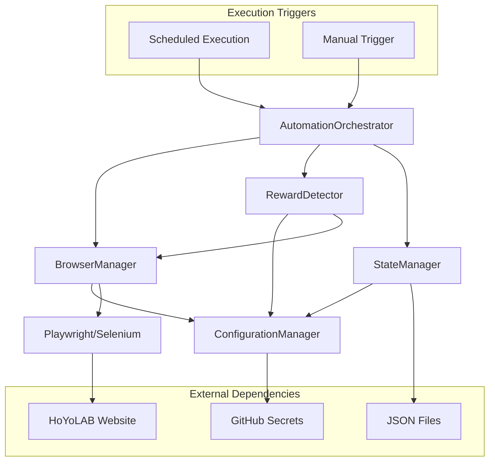

# Components

Based on the architectural patterns, tech stack, and data models from above, the system comprises several major logical components that work together to achieve reliable HoYoLAB automation.

## AutomationOrchestrator

**Responsibility:** Main entry point that coordinates the complete check-in workflow from authentication through reward collection and state logging, with support for both scheduled and manual execution modes.

**Key Interfaces:**
- `execute_checkin()` - Main automation workflow execution
- `execute_manual_trigger()` - Manual fallback execution for critical streak maintenance
- `handle_failure(exception)` - Centralized error handling and recovery
- `log_execution_result(result)` - State management and success tracking
- `validate_execution_mode()` - Determine scheduled vs manual execution context

**Manual Trigger Support:** Provides emergency fallback option when scheduled automation fails, accessible via GitHub Actions manual dispatch or local script execution for critical streak maintenance.

**Dependencies:** BrowserManager, RewardDetector, ConfigurationManager, StateManager

**Technology Stack:** Python 3.9+, structlog for logging, python-decouple for configuration

## BrowserManager  

**Responsibility:** Browser lifecycle management including initialization, authentication, navigation, and cleanup with anti-bot detection measures.

**Key Interfaces:**
- `initialize_browser()` - Setup Playwright/Selenium with proper configuration
- `authenticate_session()` - Handle HoYoLAB login flow with credential security
- `navigate_to_checkin()` - Navigate to check-in page with wait conditions
- `capture_failure_screenshot()` - Debug evidence collection

**Dependencies:** ConfigurationManager for browser settings and credentials

**Technology Stack:** Playwright (primary), Selenium WebDriver (fallback), httpx for session management

## RewardDetector

**Responsibility:** Intelligent reward state detection using multiple CSS selector strategies and fallback mechanisms for reliability.

**Key Interfaces:**
- `detect_reward_availability()` - Multi-strategy detection with fallback logic
- `claim_available_rewards()` - Automated clicking and UI interaction
- `validate_claim_success()` - Post-action verification of reward collection

**Dependencies:** BrowserManager for DOM access, ConfigurationManager for selector configuration  

**Technology Stack:** CSS selectors, Playwright element detection, randomized timing delays

## ConfigurationManager

**Responsibility:** Centralized configuration management with environment variable handling, validation, and secure credential access.

**Key Interfaces:**
- `get_credentials()` - Secure access to HoYoLAB authentication tokens
- `get_selector_config()` - CSS selector strategy configuration
- `get_timing_config()` - Anti-bot detection timing parameters
- `validate_configuration()` - Startup configuration validation

**Dependencies:** GitHub Secrets integration, python-decouple

**Technology Stack:** python-decouple, GitHub Secrets API, environment variable validation

## StateManager

**Responsibility:** Execution history tracking, success rate calculation, and failure pattern analysis for NFR1 compliance monitoring.

**Key Interfaces:**
- `log_execution(result)` - Record automation attempt with outcome
- `calculate_success_rate(days)` - On-demand success rate calculation
- `get_failure_patterns()` - Analysis of recent failure trends
- `rotate_old_logs()` - Log management and repository size control

**Dependencies:** File system access for JSON Lines storage

**Technology Stack:** JSON stdlib, file I/O, datetime calculations

## Component Diagrams

## Epic Evolution Component Changes

**Epic 1 Components:**
- AutomationOrchestrator (basic workflow)
- BrowserManager (local browser)
- RewardDetector (core CSS logic)
- ConfigurationManager (hardcoded credentials)
- StateManager (local file storage)

**Epic 3 Component Enhancements:**
- ConfigurationManager: GitHub Secrets integration
- AutomationOrchestrator: Manual trigger support
- StateManager: Repository-based storage
- BrowserManager: Cloud environment optimization
