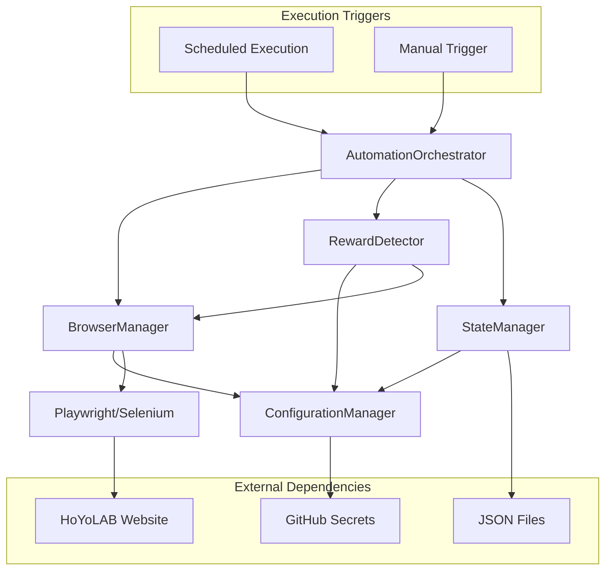

# Components

Based on the architectural patterns, tech stack, and data models from above, the system comprises several major logical components that work together to achieve reliable HoYoLAB automation.

## AutomationOrchestrator

**Responsibility:** Main entry point that coordinates the complete check-in workflow from authentication through reward collection and state logging, with support for both scheduled and manual execution modes. **Status: FULLY IMPLEMENTED**

**Key Interfaces:**
- `execute_checkin(dry_run=False)` - Main automation workflow with dry-run support for testing
- `execute_workflow()` - Core workflow orchestration from navigation to reward claiming
- `initialize()` - Component initialization and browser setup
- `cleanup()` - Resource cleanup with async context manager support

**Authentication Methods:**
- **Username/Password Login**: Automated email/password form submission through login form

**Implementation Features:**
- Username/password authentication method
- Dry-run mode for testing without actual claiming
- Modal/popup blocking detection and automatic closing
- Red point detection strategy for reward identification
- Comprehensive error handling with screenshot capture on failure
- State logging integration with success/failure tracking
- Resource cleanup even on failures (async context managers)
- Human-like timing delays throughout workflow

**Workflow Steps:**
1. Initialize browser and components
2. Navigate to HoYoLAB check-in page
3. Authenticate (username/password or cookies)
4. Close blocking modals if present
5. Detect rewards using red point strategy
6. Claim available rewards with confirmation handling
7. Log execution result to state manager
8. Cleanup resources

**Manual Trigger Support:** Accessible via GitHub Actions manual dispatch with optional dry-run mode for testing without affecting reward claims.

**Dependencies:** BrowserManager, RewardDetector, ConfigurationManager, StateManager, TimingUtils

**Technology Stack:** Python 3.11+, structlog for logging, python-decouple for configuration, async/await patterns

## BrowserManager

**Responsibility:** Browser lifecycle management including initialization, authentication, navigation, and cleanup with anti-bot detection measures.

**Key Interfaces:**
- `initialize_browser()` - Setup Playwright/Selenium with proper configuration
- `authenticate_session()` - Handle HoYoLAB login flow with credential security
- `navigate_to_checkin()` - Navigate to check-in page with wait conditions
- `capture_failure_screenshot()` - Debug evidence collection

**Dependencies:** ConfigurationManager for browser settings and credentials

**Technology Stack:** Playwright (primary), Selenium WebDriver (fallback), httpx for session management

## RewardDetector

**Responsibility:** Intelligent reward detection using multiple CSS selector strategies and fallback mechanisms for reliability. **Status: FULLY IMPLEMENTED**

**Key Interfaces:**
- `detect_reward_availability()` - Multi-strategy detection with fallback logic, state differentiation (claimable/claimed/unavailable), and confidence scoring
- `claim_available_rewards()` - Automated clicking and UI interaction with retry logic, confirmation dialog handling, and human-like timing delays
- `validate_claim_success()` - Post-action verification through UI feedback detection, state change analysis, and screenshot capture
- `handle_claiming_errors()` - Comprehensive error recovery for network timeouts, element not found, authentication failures, and UI changes
- `analyze_interface()` - Interface analysis with strategy selection and selector discovery

**Implementation Features:**
- Red point detection strategy using `.mhy-icon-font-point` selector
- Multi-layered fallback detection with confidence scoring
- Confirmation dialog handling with multiple selector patterns
- State change detection comparing pre/post claim states
- Screenshot capture for success verification
- Retry logic with configurable attempts
- Human-like timing delays between interactions

**Dependencies:** BrowserManager for DOM access, ConfigurationManager for selector configuration, TimingUtils for anti-bot delays

**Technology Stack:** CSS selectors, Playwright element detection, randomized timing delays, async/await patterns

## ConfigurationManager

**Responsibility:** Centralized configuration management with environment variable handling, validation, and secure credential access. **Status: FULLY IMPLEMENTED** (includes validation logic)

**Key Interfaces:**
- `get_hoyolab_credentials()` - Secure access to HoYoLAB authentication (supports dual methods)
- `get_hoyolab_url()` - HoYoLAB check-in URL configuration
- `get_browser_config()` - Browser settings (headless, timeout, viewport, user agent)
- `get_detection_config()` - Reward detection settings (timeouts, retries, selectors)
- `get_timing_config()` - Anti-bot detection timing parameters
- `validate_environment()` - Comprehensive startup configuration validation
- `redact_secrets()` - Secret redaction for safe logging

**Authentication Configuration:**
- Uses username/password authentication via `HOYOLAB_USERNAME` and `HOYOLAB_PASSWORD`

**Configuration Features:**
- Environment variable validation with clear error messages
- Default values for all optional settings
- Secret redaction for logging safety
- Browser viewport and user agent customization
- Detection retry and timeout configuration
- Timing variance for human-like behavior

**Dependencies:** GitHub Secrets integration (via environment variables), python-decouple

**Technology Stack:** python-decouple, environment variable validation, dataclasses for credentials

## StateManager

**Responsibility:** Execution history tracking, success rate calculation, and failure pattern analysis for NFR1 compliance monitoring. **Status: FULLY IMPLEMENTED** (includes analytics)

**Key Interfaces:**
- `log_execution_result(result)` - Record automation attempt with outcome in JSONL format
- `calculate_success_rate(days=7)` - Calculate success rate over specified period with detailed statistics
- `get_execution_history(limit)` - Retrieve execution history (most recent first)
- `get_last_execution_result()` - Get most recent execution result
- `cleanup_old_logs(keep_days=30)` - Automatic log rotation and cleanup
- `initialize()` - Ensure log directory and file exist

**Implementation Features:**
- JSONL (JSON Lines) format for append-only logging
- Async lock for thread-safe concurrent access
- UTC timestamp handling with ISO 8601 format
- Success rate calculation with configurable date ranges
- Automatic log rotation to prevent file growth
- Statistics include total executions, successful count, and percentage
- Graceful handling of missing or corrupted log entries

**Storage Format:**
```json
{"timestamp": "2025-11-30T06:00:00Z", "success": true, "duration_seconds": 23.4, "selector_used": "primary"}
{"timestamp": "2025-11-30T07:00:00Z", "success": false, "duration_seconds": 45.2, "error_message": "...", "screenshot_artifact": "..."}
```

**Dependencies:** File system access for JSON Lines storage (`logs/execution_history.jsonl`)

**Technology Stack:** JSON stdlib, asyncio locks, file I/O, datetime calculations with timezone support

## Component Diagrams



## Implementation Status

**Current Status: Epic 1 Complete** (Local POC fully functional)

**Completed Components:**
- ✅ AutomationOrchestrator (complete workflow with dry-run support)
- ✅ BrowserManager (Playwright primary, Selenium fallback abstraction)
- ✅ RewardDetector (complete with red point detection, claiming, validation)
- ✅ ConfigurationManager (dual auth methods, GitHub Secrets ready)
- ✅ StateManager (JSONL logging with analytics)
- ✅ GitHub Actions workflow (daily-checkin.yml with manual trigger)
- ✅ Deployment documentation (quick-start and comprehensive guides)

**Key Features Implemented:**
- Dual authentication (username/password + cookies)
- Red point detection strategy (`.mhy-icon-font-point`)
- Modal/popup blocking detection and closing
- Comprehensive error handling with screenshot capture
- Human-like timing delays throughout workflow
- Dry-run mode for testing
- Success rate tracking and analytics
- Async/await patterns throughout
- Resource cleanup with context managers

**Ready for:** Epic 2 (Core Automation Engine enhancements) and user validation testing
