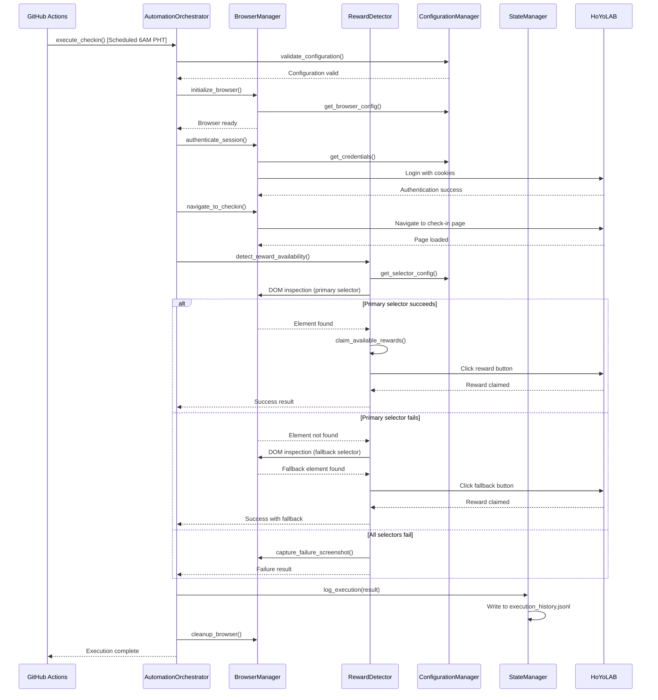
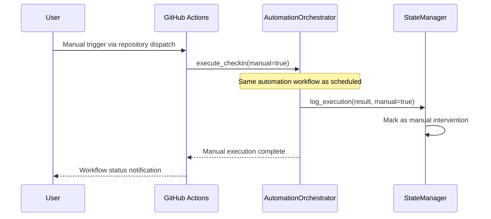

# Core Workflows

The following sequence diagrams illustrate key system workflows that clarify architecture decisions and complex interactions.

## Daily Check-in Automation Workflow

## Manual Trigger Fallback Workflow

