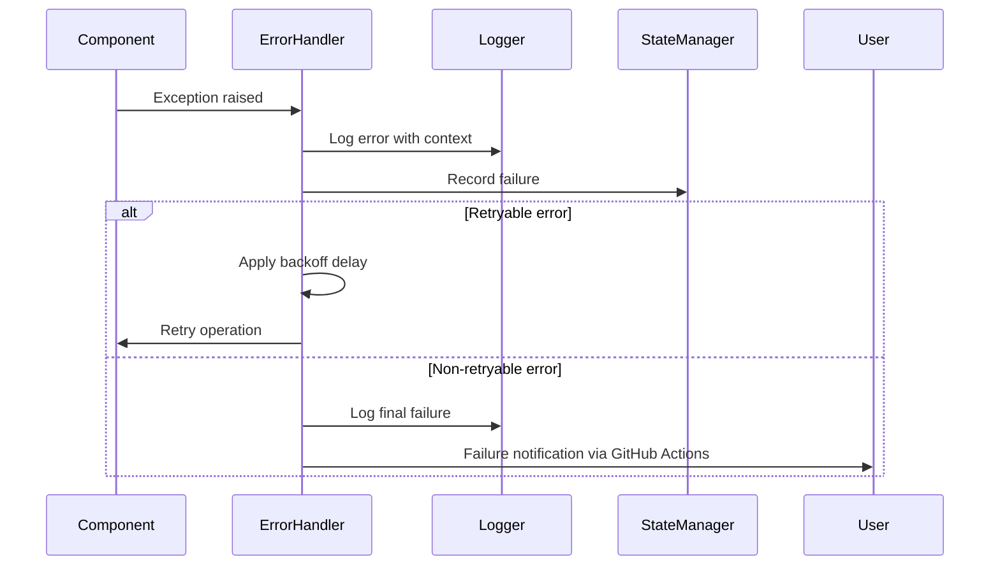

# Error Handling Strategy

Unified error handling ensures graceful failure management and comprehensive debugging support across the automation system.

## Error Flow



## Error Response Format

```python
@dataclass
class AutomationError:
    error_type: str
    message: str
    details: Optional[Dict[str, Any]]
    timestamp: str
    execution_id: str
    retryable: bool

    def to_dict(self) -> Dict[str, Any]:
        return {
            "error": {
                "type": self.error_type,
                "message": self.message,
                "details": self.details or {},
                "timestamp": self.timestamp,
                "execution_id": self.execution_id,
                "retryable": self.retryable
            }
        }
```

## Backend Error Handling

```python
class AutomationErrorHandler:
    def __init__(self, logger, state_manager):
        self.logger = logger
        self.state_manager = state_manager
        self.retry_attempts = 0
        self.max_retries = 3

    def handle_error(self, error: Exception, context: Dict[str, Any]) -> AutomationResult:
        """Central error handling with retry logic and state management"""

        error_info = AutomationError(
            error_type=type(error).__name__,
            message=str(error),
            details=self._extract_error_context(error, context),
            timestamp=datetime.utcnow().isoformat(),
            execution_id=context.get('execution_id'),
            retryable=self._is_retryable_error(error)
        )

        # Log error with structured context
        self.logger.error(
            "Automation error occurred",
            error_type=error_info.error_type,
            error_message=error_info.message,
            retryable=error_info.retryable,
            retry_attempt=self.retry_attempts,
            **error_info.details
        )

        # Record failure in state management
        self.state_manager.log_execution(
            ExecutionLog(
                timestamp=error_info.timestamp,
                success=False,
                duration_seconds=context.get('duration', 0),
                error_message=error_info.message,
                screenshot_artifact=context.get('screenshot_path'),
                selector_used=context.get('selector_used', 'unknown')
            )
        )

        # Retry logic for transient errors
        if error_info.retryable and self.retry_attempts < self.max_retries:
            self.retry_attempts += 1
            delay = 2 ** self.retry_attempts  # Exponential backoff
            self.logger.info(f"Retrying in {delay} seconds...", retry_attempt=self.retry_attempts)
            time.sleep(delay)
            return None  # Signal retry needed

        # Final failure - no more retries
        return AutomationResult(
            success=False,
            error=error_info,
            completed=True
        )

    def _is_retryable_error(self, error: Exception) -> bool:
        """Determine if error is worth retrying"""
        retryable_types = (
            TimeoutError,
            ConnectionError,
            BrowserDisconnectedError,
            TemporaryElementNotFoundError
        )
        return isinstance(error, retryable_types)
```
