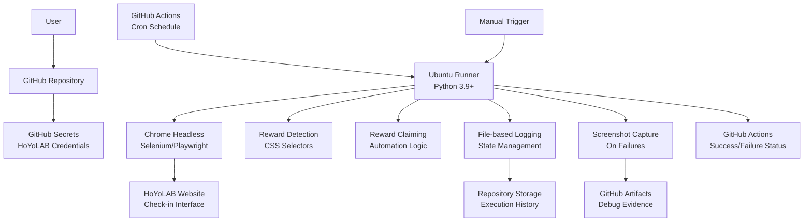

# High Level Architecture

## Technical Summary

The Genshin Impact Check-in Bot employs a **serverless automation architecture** deployed on GitHub Actions, utilizing Python-based browser automation to interact with the HoYoLAB web interface. The system follows a **monolithic script pattern** optimized for cloud execution constraints, implementing intelligent reward detection through CSS selector strategies and robust error handling. The architecture prioritizes **reliability over complexity**, using file-based state management and comprehensive logging to achieve the required 70% success rate. GitHub Secrets provide secure credential management while maintaining zero-cost operation within free tier limits. The design emphasizes **educational value** through clear separation of concerns, extensive documentation, and maintainable code patterns suitable for portfolio demonstration.

## Platform and Infrastructure Choice

**Selected Platform:** GitHub Actions + GitHub Repository Storage
**Key Services:** GitHub Actions (compute), GitHub Secrets (credential management), GitHub Repository (code and logs storage)
**Deployment Host and Regions:** GitHub's global infrastructure (automatic region selection)

**Rationale:** GitHub Actions perfectly aligns with project requirements - zero cost, educational value, integrated security, and sufficient compute resources for browser automation. The 5-minute timeout is manageable for check-in operations, and repository storage handles state management effectively.

## Repository Structure

**Structure:** Monorepo with clear separation of concerns
**Monorepo Tool:** Native Python packaging (no complex tooling needed)
**Package Organization:** Functional separation by Epic boundaries

```
genshin-checkin-bot/
├── src/                        # Core automation code
│   ├── automation/             # Browser automation logic
│   ├── detection/              # Reward detection strategies  
│   ├── config/                 # Configuration management
│   └── utils/                  # Shared utilities
├── tests/                      # Comprehensive test suite
├── .github/workflows/          # GitHub Actions workflows
├── docs/                       # Documentation and architecture
├── logs/                       # Execution history and state
└── scripts/                    # Setup and maintenance scripts
```

## High Level Architecture Diagram



## Architectural Patterns

- **Serverless Automation Pattern:** Stateless execution optimized for cloud environments with minimal resource usage - _Rationale:_ Perfect fit for GitHub Actions constraints and zero-cost operation
- **Circuit Breaker Pattern:** Fail-fast with retry logic to handle transient failures and prevent resource waste - _Rationale:_ Essential for unreliable web automation scenarios
- **Strategy Pattern:** Multiple CSS selector detection strategies with fallback mechanisms - _Rationale:_ Handles website changes and improves reliability
- **Command Pattern:** Encapsulated automation actions for testing and maintenance - _Rationale:_ Enables unit testing and modular development
- **Observer Pattern:** Event-driven logging and state management throughout automation lifecycle - _Rationale:_ Comprehensive debugging and success rate tracking
- **Template Method Pattern:** Standardized automation workflow with customizable steps - _Rationale:_ Consistent execution while allowing Epic-based enhancements
